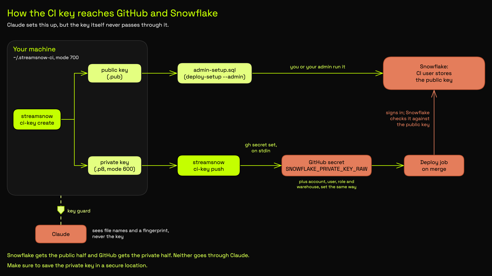

<!-- markdownlint-disable MD041 -->
<h1 align="center">StreamSnow ❄️</h1>

<p align="center">
  <a href="https://github.com/kyle-chalmers/streamsnow/actions/workflows/ci.yml"></a>
  <a href="https://pypi.org/project/streamsnow/"></a>
  
  <a href="LICENSE"></a>
  
</p>

<p align="center">
  <strong>The world's best open-source plugin for creating Snowflake
  Streamlit data apps with AI.</strong>
</p>

<p align="center">
  <em>Scaffold a governed monorepo, build dashboards inside enforced
  data-governance guardrails, and deploy them to Snowflake — without
  learning the rules by hand.</em>
</p>

---

> **Status: beta, functional.** The CLI (configure / init / new / doctor /
> validate-app / preview / check / sql-review / review-gate / review-loop /
> migrate / nav / deploy-sql / deploy-setup / ci-key / verify-deploy / update /
> agent-skills) and the Claude Code plugin (8 skills + shared recipes) are
> implemented and CI-green for
> both runtimes and both deploy sources. Published on PyPI (`uvx streamsnow` /
> `pip install streamsnow`); APIs may still evolve toward 1.0 — see
> [Versioning and stability](docs/versioning.md) for what is already promised.

## Mission

**StreamSnow aims to let a data team build and ship, quickly and safely,
Streamlit-in-Snowflake apps that load fast, can be trusted, and help people make
decisions, by turning production lessons into scaffolding, checks, and guidance
that people and AI sessions can follow without having to remember them.**

## Vision

**A data professional, with or without an AI assistant, can take a dashboard
from idea to a governed, verified deployment in Snowflake without learning the
platform's traps the hard way; a reviewer with Snowsight can re-run the SQL
behind the numbers it shows; and the people it's built for can open it,
understand it, and act on it without a walkthrough.**

**This is for you if:**

- ✅ you run, or will run, more than one Streamlit app in Snowflake with more
  than one author
- ✅ you want Claude Code sessions and humans held to the same governance rules
- ✅ you want a reviewer to re-run a dashboard's SQL in Snowsight without
  reading Python
- ❌ you host Streamlit outside Snowflake, or you need a scheduler or a data
  catalog (StreamSnow does neither)
- ❌ your dashboards are for people without Snowflake logins, out of the box
  (possible with customization; see below)

**Where it fits next to a BI tool.** For internal analytics, meaning dashboards
your own Snowflake users open in Snowsight, StreamSnow can replace a BI tool:
the apps are reviewed Python, they run where the data lives, and Snowflake roles
manage access. Customer-facing dashboards, embedding, and pixel-perfect
scheduled reports are possible but need customization beyond what ships today.

**Who can use this.** Anyone with a Snowflake account (any edition runs
Streamlit in Snowflake; StreamSnow does not need Enterprise-only masking or row
access policies) and either a role with `CREATE STREAMLIT` on one schema or an
admin willing to run the one-time bootstrap that `streamsnow deploy-setup --admin`
prints ([Deploy setup](docs/deploy-setup.md)). Building and previewing locally
needs only a login that can read your data.

**Principles** every change is judged against:

1. **One implementation, many consumers:** CLI, plugin, pre-commit, and CI call the same code.
2. **Detection is automated and total; destruction requires explicit committed consent.**
3. **The backstop asks; it never decides:** the gates are `validate-app` and CI, not the review nudge.
4. **Org knowledge lives in `streamsnow.config.yaml` and `.streamsnow/`** (overlays and the house design guide), never in skills.
5. **Every rule names the incident that created it and the mechanism that enforces it.**
6. **Degrade, don't die:** a missing enabler is named, not refused.
7. **Faithful to a real fleet:** a check that fails a well-run production app is a defect in the check until proven otherwise (`tests/fixtures/fleet/` is the regression net).
8. **Leaving should be cheap:** everything StreamSnow writes is a plain file the repo keeps ([Ownership and exit](docs/distribution.md#ownership-and-exit)).
9. **Design is a default, not a gate:** StreamSnow ships opinionated defaults with their reasons, the org's house style overrides them, and only correctness and governance block a ship.

## What Claude can and can't see

StreamSnow asks Claude to set up Snowflake access, CI and deploy secrets on your
behalf. Here is exactly what that means for your credentials.

- **Claude never sees a password, private key or token.** Sign-ins happen in
  your browser, and StreamSnow never asks for, stores or handles a Snowflake password.
- **The CI key goes from a file on your machine to GitHub without passing
  through Claude.** `streamsnow ci-key create` makes the key pair in
  `~/.streamsnow-ci` and prints only file names and a fingerprint. `streamsnow
  ci-key push` hands each secret to the GitHub CLI on standard input, never on
  the command line, and prints only names.
- **Save a copy of the private key somewhere safe.** Put
  `~/.streamsnow-ci/streamsnow_ci_rsa_key.p8` in a password manager or similar
  store yourself; Claude never opens it. If it is ever lost, make a new pair
  and re-run the admin script ([rotating the key](SECURITY.md#how-streamsnow-handles-secrets)).
- **Snowflake gets only the public half of the key.** It goes into the admin
  script, which you or your Snowflake admin run. Claude never runs it and
  creates no Snowflake objects itself.
- **Claude's tools are blocked from the key directory.** The plugin's key
  guard (`hooks/secret_guard.py`) denies any read, search, edit or shell
  command that points at it, apart from plain `streamsnow ci-key` and
  `streamsnow deploy-setup` commands.
- **Setup queries are read-only.** The setup flow reads your account with
  `SHOW` and `SELECT` queries only, and never prints connection files or
  `SNOWFLAKE_*` values.

<p align="center">
  <a href="docs/images/secrets-flow.png"></a>
</p>

The limits, stated plainly: Claude runs as your user account, so the key guard
is a backstop, not a sandbox, and it runs only inside Claude Code. The full
detail is in [SECURITY.md](SECURITY.md#how-streamsnow-handles-secrets).

## Install with your coding agent

Point any coding agent (Claude Code, Codex, Cursor, Gemini CLI, and others) at
this repo and say: *"Read the install prompt in
github.com/kyle-chalmers/streamsnow and follow it."* Or paste the prompt in
yourself:

```text
Install StreamSnow (https://github.com/kyle-chalmers/streamsnow) for me at the
project level: enable the plugin and install the skills for this repo only,
never at the user level. Confirm with me before installing anything, and stop at
each question you cannot answer on my behalf.

1. Work in the git repo for my Snowflake apps. Ask me which folder if unsure; if it
   is new, create it and run `git init`. Run every command below from its root.

2. If you are Claude Code: run
   `claude plugin marketplace add --scope project kyle-chalmers/streamsnow` and then
   `claude plugin install --scope project streamsnow@streamsnow`. Both record the
   plugin in this repo's .claude/settings.json, not my user settings. Tell me to
   type `/reload-plugins` (no restart needed) and then `/onboard`. Stop
   there; that skill does the rest.

3. Any other agent: make sure `uv` is installed, then run `uv tool install streamsnow`
   and confirm `streamsnow --version` answers (the CLI is a command on my PATH; the
   skills call it by name). Run `streamsnow doctor` and fix each failing required
   check one at a time, re-running doctor after each fix.

4. If the repo already has a `streamsnow.config.yaml`, it is set up: run `streamsnow doctor`,
   and run `streamsnow init --no-starter-app` only if its `repo-files` row lists missing files.
   Otherwise, if the repo already has Streamlit apps, read
   https://github.com/kyle-chalmers/streamsnow/blob/main/skills/onboard/adopt.md and
   follow that instead of scaffolding. Otherwise set up with `streamsnow init --no-starter-app`.
   Its wizard asks five questions. Answer what you can first with read-only SHOW queries
   over whatever Snowflake access I already have (my default snow connection, a Snowflake
   MCP server, a dbt profile), ask me only what you could not settle, then pass the
   confirmed answers as flags (see `streamsnow init --help`). If you cannot, hand the
   wizard to me.

5. Run `streamsnow agent-skills install --agent codex` (repo scope, the default; never
   `--scope user`). It copies the skills into this repo's .agents/skills, which Codex
   reads; any other agent can open .agents/skills/onboard/SKILL.md directly. Then
   follow onboard, and then build-app to build my first app.

Rules: never ask me for a Snowflake password or key in chat; if I choose, you may set
up my snow connection with flags, and I approve the sign-in in my browser. Never run
the admin SQL that `streamsnow deploy-setup --admin` prints; prepare it for me or my
Snowflake admin.
```

Only Claude Code and Codex are tested. Prefer to type the steps yourself? See
[Quickstart](#quickstart), and [Use with other agents](#use-with-other-agents)
for what differs outside Claude Code.

## How the skills fit together

<p align="center">
  <a href="docs/images/skills-flow.png"></a>
</p>

The source is [docs/images/skills-flow.excalidraw](docs/images/skills-flow.excalidraw);
open it at [excalidraw.com](https://excalidraw.com) to edit, then re-export the PNG.

## What it is

StreamSnow is a **hybrid** of two things that work together:

1. **A `streamsnow` CLI** (PyPI) — scaffolds a governed Streamlit-in-Snowflake
   monorepo, runs an interactive setup wizard, and vendors the validation
   tools, CI, pre-commit hooks, and branding your repo needs.
2. **A Claude Code plugin** (marketplace) — ships the skills and
   hooks that turn Claude Code into a domain expert for this stack:
   `/build-app` (the front door), `/preview-app`, `/validate-app`,
   `/review-app`, `/ship-app`, and more.

Think **a Claude Code skill pack fused with an installable system + setup**.
The CLI gives you the substrate; the plugin gives Claude the playbook. A single
`streamsnow.config.yaml` is the source of truth both read from.

## Why

Building Streamlit apps on Snowflake well means getting a hundred small things
right: caching with TTLs, parameterized SQL that survives the deployed Go
driver, runtime selection (container vs. warehouse), schema access guardrails,
a deploy pipeline, branding, and review discipline. StreamSnow encodes those as
**executable guardrails** — pre-commit + CI gates, scaffolding templates, and
Claude Code skills — so every developer (and every Claude session) follows the
same rules and ships safely.

## Two things you choose

StreamSnow treats two axes as first-class, configurable options:

| Axis | Options |
|------|---------|
| **Runtime** | **Container** (default — GA since March 2026, full PyPI, local preview matches deploy) or **Warehouse** (instant start, Anaconda channel, no compute-pool cost). Snowflake's own comparison: [runtime environments](https://docs.snowflake.com/en/developer-guide/streamlit/app-development/runtime-environments) |
| **Deploy source** | **Stage-copy** (default: CI uploads to an internal stage) or **Snowflake `GIT REPOSITORY`** (Snowflake pulls from your Git repo; see [Switching to Git repository](docs/git-repository.md)) |

## Quickstart

Two lanes; pick the one that matches how you work. Both end at the same governed
repo, and both need Python 3.11+, `uv`, and `git` (`uvx streamsnow doctor` tells
you what is missing).

### With Claude Code (recommended)

From the root of your apps repo, install the plugin at project scope (it is
recorded in the repo's `.claude/settings.json`, not your user settings):

```bash
claude plugin marketplace add --scope project kyle-chalmers/streamsnow
claude plugin install --scope project streamsnow@streamsnow
```

Then, in a Claude Code session in that repo, load it without restarting and
start setup:

```
/reload-plugins
/onboard
```

`/reload-plugins` picks up the plugin's skills and hooks in the running session.
StreamSnow's one-line session-start message first appears in your next session.

`/onboard` gets your machine, repo and Snowflake account ready, in four stages,
and says what it is doing at every step:

1. **Check and prepare.** It works out what is already set up, reads your
   Snowflake account with read-only queries over whatever access you have (a
   `snow` connection, a Snowflake MCP server, a dbt profile), and installs any
   missing tools after one approval.
2. **One round of questions.** Clickable choices for what it could not work
   out: the five setup answers, your git name if it is missing, and who runs
   the Snowflake admin script.
3. **Build.** The config and the governed repo files (`AGENTS.md`, pre-commit
   hooks, CI, `.gitignore`, README), only after you confirm.
4. **Finish.** The CI key, the admin script (copied for you to run in
   Snowsight, or written up for your admin), and the deploy secrets.

It ends "ready to build and preview" (next: `/build-app`) or "ready to deploy".
Your part: approve installs, answer one round of questions, approve sign-ins in
your browser, and run the admin script in Snowsight if you are the admin. In a
repo that already has Streamlit apps it maps onto them and writes a
`MIGRATION.md`, never scaffolding over you. Re-run `/onboard` any time to check.

### CLI only

```bash
uv tool install streamsnow           # persistent `streamsnow` on your PATH
mkdir my-snowflake-apps && cd my-snowflake-apps
streamsnow init                      # 5-question wizard, then a governed scaffold
# or skip the prompts: streamsnow init --runtime warehouse --account <locator> \
#   --database ANALYTICS --schemas MARTS,REPORTING --deploy-source stage-copy
snow connection add --connection-name <name> --account <locator> \
  --user <you> --authenticator externalbrowser --default   # init prints the exact command
uv tool install pre-commit && pre-commit install
streamsnow validate-app example-dashboard                 # PASS proves the scaffold is whole
uv venv --python 3.11 && uv pip install -e apps/example-dashboard   # container runtime
streamsnow preview example-dashboard
```

On the warehouse runtime an app has `environment.yml` instead of `pyproject.toml`,
so install its packages directly (`init` and `streamsnow preview` print the exact
line).

One connection store: `st.connection("snowflake")` reads the `snow` CLI's default
connection locally, so the per-app `secrets.toml` is an optional override, not a
second place to type the same values.

### Upgrading

The two halves upgrade separately, and the plugin half does **not** pick up
hook or skill changes on its own — an installed copy stays at the version it
was installed at until you reinstall it.

```bash
claude plugin list                                              # installed plugin version
claude plugin uninstall --scope project streamsnow@streamsnow
claude plugin install --scope project streamsnow@streamsnow    # then /reload-plugins in Claude Code
```

```bash
uv tool upgrade streamsnow               # the CLI
streamsnow update                        # dry-run: governance files the new templates would change
streamsnow update --apply                # re-render AGENTS.md, hooks, CI, deploy.yml
```

Generated CI and deploy workflows pin `streamsnow>=0.8,<0.9`; bump the pin with
`update --apply` when you move majors.
`claude plugin details streamsnow@streamsnow` lists the 8 skills below.

## The skills

One front door plus focused verbs — each skill's `SKILL.md` stays under 80
lines, with depth in per-skill reference files:

| Skill | What it does |
|---|---|
| `/onboard` | Machine, repo and Snowflake setup in four stages; detects what is done and does only what is missing. Also adopts repos that already have apps (maps onto them, writes `MIGRATION.md`) |
| `/build-app` | The front door for apps: spec (incl. backfill from existing source) → data discovery → page design → scaffold → pages built in parallel by subagents → review → ship, with checkpoints. `--feedback` turns feedback on a live app into classified fixes built the same way. Hands off to `/onboard` if the machine or repo isn't set up |
| `/preview-app` | Run an app locally against live Snowflake |
| `/validate-app` | The pass/fail check that must be clean before shipping |
| `/review-app` | Senior-reviewer-grade review; `--fix` applies findings, `--auto` loops to clean (executable loop primitives + per-change coverage stamping), `--sql` builds the app's `sql_review/` page files |
| `/audit-lineage` | Live-warehouse column + lineage verification (read-only, bounded) |
| `/ship-app` | Validate-gated stage → commit → push → PR → watch CI |
| `/migrate-app` | Port an external Streamlit app in (lift, then conform) |

## Use with other agents

The skills are plain `SKILL.md` folders in the open
[Agent Skills](https://agentskills.io/specification) format, so a coding agent
other than Claude Code can follow them. OpenAI Codex CLI 0.157.1 is the only
one tested. The CLI installs them where Codex looks:

```bash
streamsnow agent-skills install --agent codex               # <repo>/.agents/skills; commit it
streamsnow agent-skills list --agent codex                  # what is installed, and from which version
```

Then ask Codex for a skill by name (`$build-app`) or in plain words ("use the
StreamSnow build-app skill to build..."). In a test with `codex exec`, Codex
found the skills in `.agents/skills`, read the `SKILL.md` files and the recipes
they link, and finished an offline app build that passed `validate-app`. The
install is a copy: re-run it after `uv tool upgrade streamsnow`, and put
repo-specific changes in `.streamsnow/overlays/`, because the command refuses
to overwrite an edited skill without `--force`.

**The same under any agent:** the `streamsnow` CLI and its checks,
`validate-app`, the pre-commit hooks and CI. They run outside the agent.

**Different outside Claude Code** (each skill points the agent at
[skills/_shared/other-agents.md](skills/_shared/other-agents.md)):

- **Skill names.** `/ship-app` is Claude Code's syntax; Codex uses `$ship-app`.
  The install marks `ship-app` and `migrate-app` explicit-only in Codex
  (`allow_implicit_invocation: false`), matching their
  `disable-model-invocation` in Claude Code.
- **Checkpoints.** A checkpoint is a question the agent stops at. `codex exec`
  cannot ask you, so a non-interactive run stops at the first checkpoint its
  prompt does not answer. In the test it stopped at the spec checkpoint, and a
  second run whose prompt gave that answer resumed from `REQUIREMENTS.md`.
- **Reviewers.** `/review-app` fans out reviewers as Claude Code subagents; the
  skill tells an agent without subagents to run the same briefs one after
  another.
- **Browser walkthroughs.** They run the Playwright CLI through `npx`, so they
  work under Codex too, but only when its sandbox allows network access and
  writes to `~/.npm` and `~/.cache/ms-playwright`; otherwise they are skipped
  and every other check still runs.
- **Claude Code only: the plugin hooks** in [Hooks, in full](#hooks-in-full)
  have no Codex equivalent, so StreamSnow cannot pause a destructive `snow`
  command, nudge for a review, or print its session-start line there. The
  skills ask the agent to keep those guards by hand, and in the test Codex ran
  `streamsnow review-gate classify` itself. Those guards now rest on the agent
  following the skill; nothing enforces them.

## SQL review (redesigned in 0.8)

Every page of an app gets **SQL a person can run**: `apps/<slug>/sql_review/NN_<page>.sql`,
one section per metric in on-screen order, each runnable on its own (cursor + Cmd/Ctrl+Enter in
DataGrip, or pasted into Snowsight) with its review window in its own `params` CTE. The files are
generated from `sql_review/index.yaml`, which lists each page's metrics and the app query behind
each, and verified by an import-free gate (`streamsnow sql-review check`): provenance digests,
the `review_value("<key>", value)` markers that tie each visual in page code to its section,
sqlfluff lint and comment rules for the app's queries, and a folder of maintained DDL
(`app_specific_reporting_objects/`) for views built just for the app. Drift, hand edits, marker
mismatches and lint always fail the gate; whether an *uncovered* page or query fails or warns is
your repo's call — `sql_review: {coverage: warn | fail}` in `streamsnow.config.yaml` (default
`warn`, so an adopting fleet backfills on its own schedule). A person with nothing but a SQL editor
can trace a covered visual back to the data and confirm it — see
**[Auditing a visual](docs/auditing-a-visual.md)**. 0.8.0 replaced the 0.6/0.7 manifest format with
no automatic migration (the same page has the upgrade steps).

## Make it yours — repo overlays (new in 0.6.1)

The skills are generic procedures; your org's knowledge layers on top without
forking them. Commit `.streamsnow/overlays/<skill>.md` files and every skill
reads its overlay first — extra steps, local failure signatures, environment
specifics, explicit overrides. Plugin upgrades never touch them; overlays may not
skip mandatory gate invocations, and the coded gates (hooks, CI, pre-commit)
run outside skill prose entirely. See
[skills/_shared/overlays.md](skills/_shared/overlays.md).

## Hooks, in full

Trust demands transparency: this plugin runs hooks, so here is every one of them. All are
stdlib-only, make **no network calls**, never write outside the repo (plus one best-effort
dedupe state file in `$TMPDIR`, so the review nudge fires once per state, not every turn),
and fail open, so a hook error never blocks your session. The one exception is the key guard,
which denies rather than asks, and denies even if it hits an error on a call that names the key directory.

| Event | Script | What it does |
|---|---|---|
| PreToolUse (Bash) | `hooks/deploy_safety.py` | Pauses before destructive Streamlit/SQL commands (`snow streamlit deploy/drop`, `CREATE OR REPLACE / DROP / ALTER STREAMLIT`, stage `REMOVE`, destructive SQL incl. `-f` files / stdin) — `/ship-app` is the sanctioned deploy path |
| PreToolUse (shell, file and search tools) | `hooks/secret_guard.py` | Denies any tool call that names the CI key directory (`~/.streamsnow-ci`) or key file, apart from `streamsnow ci-key ...` and `streamsnow deploy-setup ...`. Covers the shell (Bash, PowerShell), file and search tools. Not repo-gated, because the key is sensitive in any repo. See [What Claude can and can't see](#what-claude-can-and-cant-see) |
| SessionStart | `hooks/session_start.sh` | One line inside a StreamSnow repo (plugin version, skills, which guards are active, and a nudge when this clone has no pre-commit hook); a one-line `/onboard` nudge in a repo that has Streamlit apps or the plugin enabled but no config; silence everywhere else |
| Stop | `hooks/review_gate_stop.py` | Warn-only nudge (a `systemMessage`, never a turn continuation) when a substantive app change ends with no review covering it — points at `/review-app <slug> --auto`. Off-switches: `REVIEW_GATE_OFF=1`, `apps/<slug>/.review/SKIP`, or `review_gate: {enabled: false}` in config |

All hooks except the key guard are repo-gated on `streamsnow.config.yaml` (zero cost in unrelated repos) and
declare explicit timeouts so a hung hook can never stall a session. To turn them off, disable
the plugin (`claude plugin disable streamsnow`). Hook additions do not reach installed copies
automatically — see [Upgrading](#upgrading).

### The browser tool

The skills click through each page of your running app and screenshot it with Microsoft's
[Playwright CLI](https://www.npmjs.com/package/@playwright/cli), pinned to an exact version and
run through `npx` only when a skill walks your app, so you see a broken page before it ships.
There is no MCP server to start. Unlike the hooks it does use the network: `npx` downloads the
pinned package from npm the first time, and the CLI downloads its own browser once. It needs
Node.js 20+; without Node the walkthroughs are skipped and everything else works.
`streamsnow doctor` checks Node, and `/onboard` downloads the CLI and its browser ahead of time.

## How it's organized

```
streamsnow/            the PyPI package — CLI, config, policy, scaffolder, tools
  ├── cli.py           configure / init / new / doctor / check
  ├── config.py        typed + validated streamsnow.config.yaml model
  ├── policy.py        schema allow/deny single source of truth
  ├── scaffolder.py    renders a governed repo from config
  ├── _templates/      the Jinja scaffold templates (repo/ + app/)
  └── tools/           governance checks + engines (schema refs, security,
                       caching, dependency vulns, tombstones, path leaks,
                       sql_review generator, review gate/loop, migrate, doctor)
.claude-plugin/        Claude Code plugin manifest + marketplace
skills/  agents/  hooks/   Claude Code plugin surface (8 skills, incl. onboard/; hooks)
docs/  examples/            guides + a runnable no-Snowflake example app
```

> Active scaffolding lives in `streamsnow/` (templates under `streamsnow/_templates/`).

The `streamsnow` Python package is the **single source of truth** for tool
logic: the CLI, the Claude Code plugin, pre-commit, and CI all call the same
code — one implementation, many consumers.

## Documentation

- **[Getting started](docs/getting-started.md)** — run the example with no
  Snowflake, then scaffold and preview your own governed app.
- **[Data discovery](docs/data-discovery.md)** — find tables and wire queries
  inside the schema-access guardrails.
- **[Deploying](docs/deploying.md)** — ship apps to Snowflake on merge, for both
  deploy sources.
- **[Deploy setup](docs/deploy-setup.md)** — the one-time Snowflake objects and
  CI secrets the pipeline needs.
- **[Switching to Git repository](docs/git-repository.md)**: when to deploy
  from a Snowflake `GIT REPOSITORY` instead of a stage, and how to switch.
- **[Auditing a visual](docs/auditing-a-visual.md)** — the five-minute runbook
  for confirming any dashboard number against the warehouse, no code required.
- **[Production lessons](docs/production-lessons.md)** — the incidents behind
  the guardrails, genericized.
- **[Troubleshooting](docs/troubleshooting.md)** — numbered symptom / cause /
  fix entries for the first-run and deploy failures people actually hit.
- **[Official Snowflake docs, by topic](docs/snowflake-docs.md)** — every
  external docs link the toolkit relies on, with scope, retrieved date, and
  where StreamSnow deliberately differs.
- **[Distribution](docs/distribution.md)** — how StreamSnow ships (PyPI CLI +
  plugin) and why there's no separate copy-paste kit.
- **[Migrating a consumer repo](docs/migrating-a-consumer-repo.md)** — bring a
  repo with home-grown skills onto the plugin (skill map + incremental path).
- **[Versioning and stability](docs/versioning.md)** — what counts as a breaking
  change, the deprecation policy, and the path to 1.0.

## Feedback and community

- **Questions and ideas:** [Discussions](https://github.com/kyle-chalmers/streamsnow/discussions).
- **Bugs and scoped feature requests:** [open an issue](https://github.com/kyle-chalmers/streamsnow/issues/new/choose)
  with one of the forms. Issues are triaged automatically, and the ones the maintainer
  approves are often implemented by an AI agent and reviewed before merge
  ([how issues move](CONTRIBUTING.md#how-issues-move)).
- **Contributing:** [CONTRIBUTING.md](CONTRIBUTING.md), including the AI-assisted
  contribution policy. Everyone agrees to the [Code of Conduct](CODE_OF_CONDUCT.md).
- **Security:** report privately, per [SECURITY.md](SECURITY.md).

## License

[MIT](LICENSE) © Kyle Chalmers

> StreamSnow is an independent open-source project and is not affiliated with or
> endorsed by Snowflake Inc., Streamlit, or Anthropic.
