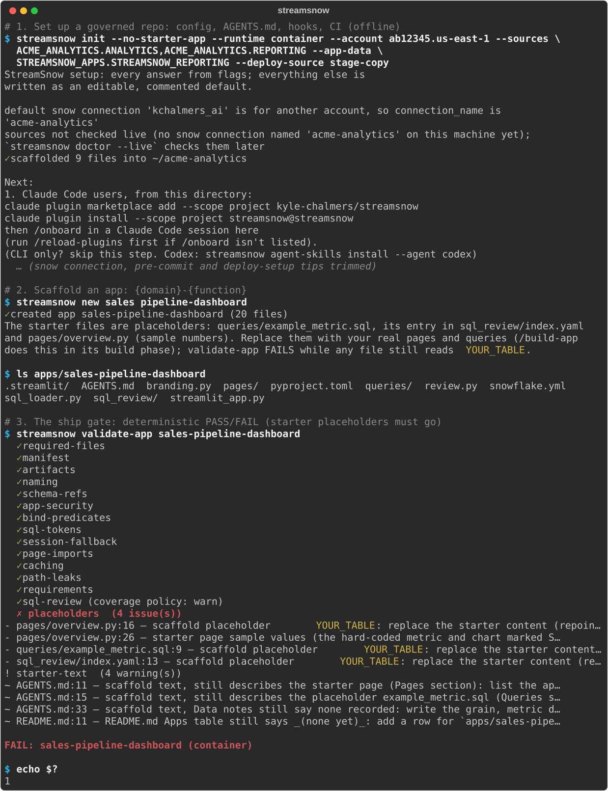

# CLI only

Set up a governed StreamSnow repo from the terminal, without Claude Code. You get the same
repo, config and checks as the [Claude Code lane](../README.md#with-claude-code-recommended);
the difference is that you run each step yourself instead of `/onboard` running them for you.
You need Python 3.11+, `uv`, and `git` (`uvx streamsnow doctor` tells you what is missing).

```bash
uv tool install streamsnow           # persistent `streamsnow` on your PATH
mkdir my-snowflake-apps && cd my-snowflake-apps
streamsnow init                      # setup wizard (every answer prefilled), then a governed scaffold
# or skip the prompts: streamsnow init --runtime warehouse --account <locator> \
#   --sources ANALYTICS.MARTS,ANALYTICS.REPORTING \
#   --app-data STREAMSNOW_APPS.STREAMSNOW_REPORTING --deploy-source stage-copy
snow connection add --connection-name <name> --account <locator> \
  --user <you> --authenticator externalbrowser --default   # init prints the exact command
uv tool install pre-commit && pre-commit install
streamsnow validate-app example-dashboard   # FAILS on the starter placeholders until you replace them
uv venv --python 3.11 && uv pip install -e apps/example-dashboard   # container runtime
streamsnow preview example-dashboard
```

<p align="center">
  
</p>

`validate-app` fails on purpose until you repoint the starter query
(`queries/example_metric.sql`) and the review window in `sql_review/index.yaml`
at your own table and replace the sample numbers in `pages/overview.py`; every
other check passing is what proves the scaffold is whole.

On the warehouse runtime an app has `environment.yml` instead of `pyproject.toml`,
so install its packages directly (`init` and `streamsnow preview` print the exact
line).

One connection store: `st.connection("snowflake")` reads the `snow` CLI's default
connection locally, so the per-app `secrets.toml` is an optional override, not a
second place to type the same values.

Next: [Getting started](getting-started.md) walks the example app and your first preview, and
the [CLI reference](cli-reference.md) lists every command.
